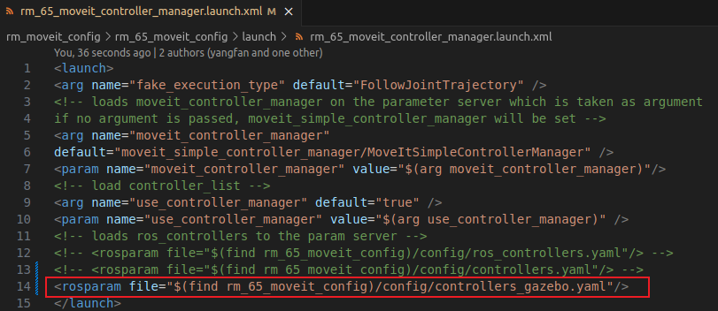

# RealMan Robot

* Version V2.6.0
* This repository provides ROS support for [RealMan robots](http://www.realman-robotics.com/). This repository holds source code for `melodic、noetic`. 

### Easy environment setup 
---
wget http://fishros.com/install -O fishros && bash fishros
cd ros_ws/src/rm_install/
chmod +x rm_install_package.sh
./rm_install_package.sh
### Installation from Source
---

For the latest features and developments you might want to install from source.<br>

1. First set up a catkin workspace (see this [tutorials](http://wiki.ros.org/catkin/Tutorials)).<br>
2. Then clone the repository into the `src/` folder. It should look like `/user_name/catkin_workspace/src/rm_robot`.<br>
3. In order to compile the package successfully, you need to install some packages related to `MoveIt`package.<br>
4. Make sure to source the correct setup file according to your workspace hierarchy, then use **catkin build** to compile.<br>
* You should compile `rm_msgs` first before compiling the source code:
```  
catkin build rm_msgs
source ~/catkin_workspace/devel/setup.bash
catkin build
source ~/catkin_workspace/devel/setup.bash
```

### Contents
----
* The repository contains packages may be unstable.<br>
* The contents of these packages are subject to change, without prior notice.<br>
* Any available APIs are to be considered unstable and are not guaranteed to be complete and / or functional.


### MoveIt! with a simulated robot
---

You can use MoveIt! to control the simulated robot like ***RVIZ*** ,***Gazebo*** or ***VREP*** environment.

**Use MoveIt in RVIZ to control the simulated robot in Gazebo:**
* ***CAUTION:*** Before running, you need to modify rm_<arm_type>_moveit_config/launch/rm_<arm_type>_moveit_controller_manager.launch.xml and load controllers_gazebo.yaml.like this 

```  
roslaunch rm_gazebo arm_<arm_type>_bringup_moveit.launch
```

* Then select `"Interact"` and move the end-effector to a new goal.

* In  `"Motion Planning"` -> `"Plan and Execute"` to send trajectory to the sim robot

* Exit RViz and Ctrl-C the Terminal window

### Usage with real robot
---
```diff
+  When you control the RealMan robot, make certain that no one is within the robot workspace and the e-stop is under operator control.
```
**CAUTION:**
* Before running, you need to modify rm_<arm_type>_moveit_config/launch/rm_<arm_type>_moveit_controller_manager.launch.xml and load controllers.yaml.
* Start the RM robot and ensure that the upper computer and the robot are on the same LAN.

**Use a new terminal for each command.**

* Start the rm_control node, run:

```
roslaunch rm_control rm_<arm_type>_control.launch
```
<arm_type> : 65、75、63、eco65、gen72

* Start the rm_driver and  MoveIt!, run:

```
roslaunch rm_bringup rm_<arm_type>_robot.launch
```
<arm_type> : 65、65_6f、75、75_6f、63、63_6f、eco63、eco65、eco65_6f、gen72、gen72_II

* Select `"Interact"` in rviz and move the end-effector to a new goal.

* In  `"Motion Planning"` -> `"Plan and Execute"` to send trajectory to the real robot

* More information in rm_doc/doc/

**CAUTION:<br>
	Mistakes made during this verification step can result in dangerous collisions when experiment with using the MoveIt planning environment to 	command trajectories with the real robot. Be certain that an E-stop is close by whenever commanding robot motion.**  
All packages of rm_robot are licensed under the Apache 2.0 license.
